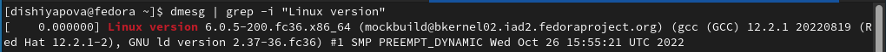
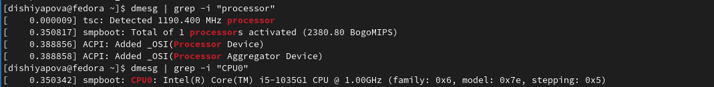
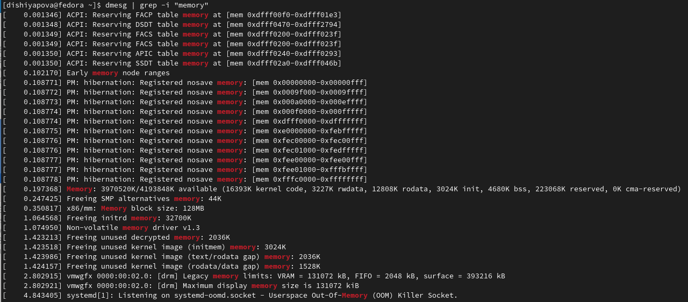
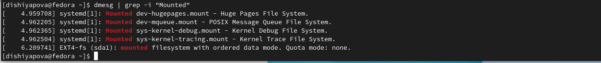
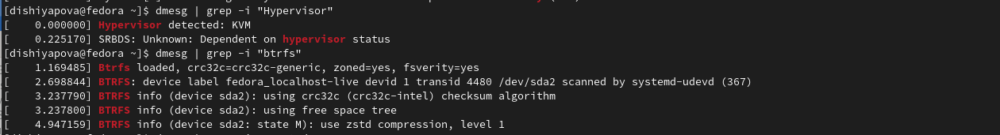

---
## Front matter
lang: ru-RU
title: Структура научной презентации
subtitle: Простейший шаблон
author:
  - Шияпова Д.И.
institute:
  - Российский университет дружбы народов, Москва, Россия
  - Объединённый институт ядерных исследований, Дубна, Россия
date: 18 февраля 2023

## i18n babel
babel-lang: russian
babel-otherlangs: english

## Formatting pdf
toc: false
toc-title: Содержание
slide_level: 2
aspectratio: 169
section-titles: true
theme: metropolis
header-includes:
 - \metroset{progressbar=frametitle,sectionpage=progressbar,numbering=fraction}
 - '\makeatletter'
 - '\beamer@ignorenonframefalse'
 - '\makeatother'
---

## Докладчик

:::::::::::::: {.columns align=center}
::: {.column width="70%"}

  * Шияпова Дарина Илдаровна
  * студент
  * Российский университет дружбы народов

:::
::: {.column width="30%"}

:::
::::::::::::::

## Цели и задачи

- Целью данной работы является приобретение практических навыков установки операционной системы на виртуальную машину, настройки минимально необходимых для дальнейшей работы сервисов.

## Выполнение лабораторной работы

Так как операционную систему мы установили и настроили еще в первом семестре, то сразу можем переходить к выполнению домашнего задания.

Получим информацию о версии ядра Linux

## Выполнение лабораторной работы

Получим информацию о частоте процессора  и его модели

## Выполнение лабораторной работы

Получим информацию о доступном объеме оперативной памяти 

## Выполнение лабораторной работы

Получим информацию о последовательности монтирования файловых систем.

## Выполнение лабораторной работы

Получим информацию о типе гипервизора.

:::

